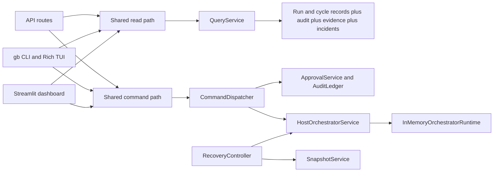

# Live AI Terrarium / Glass-Box v1 Architecture Brief

## Status

- Audience: developers
- Basis: questionnaire-derived v1 contract plus the current implementation in `src/live_ai_terrarium/`
- Purpose: describe the actual module boundaries and the shared read-path and command-path rules implemented today

## V1 Goal

v1 proves that a single Glass-Box can complete 10 stable cycles without unrecoverable failure while preserving full observability, reproducibility, and manual rollback.

The current implementation is observation-first and safety-first. Read models and evidence come first; control is explicitly unlocked and audit-tracked rather than assumed.

## Code-Grounded Architecture Summary

| Module slice | Current responsibility | Notes |
| --- | --- | --- |
| `contracts/` | ID grammar and canonical record types | Freezes the storage and observability schema shared across services. |
| `storage/paths.py` | Host-controlled roots and durable path layout | Pins `%LOCALAPPDATA%/LiveAITerrarium/state` and `%LOCALAPPDATA%/LiveAITerrarium/backups`. |
| `storage/run_evidence.py` | Run-start manifest and cycle-to-audit linkage | Proof-grade evidence fails closed when manifest or linkage is missing. |
| `storage/log_capture.py` | Brokered full-log capture | Writes append-only run log bundles on the host side. |
| `storage/exports.py` | Append-only outbox export writer | Accepts only `/workspace/.gb/outbox/...` targets and denies rewrite. |
| `audit/ledger.py` | Run-scoped hash-chained audit log | Audit chain is the authoritative source for command receipts. |
| `control/commands.py` | Canonical action names and command envelope | Freezes `observe`, `mode switch`, `pause`, `resume`, `branch`, `clone`, `reset`, and `rollback`. |
| `control/dispatcher.py` | Shared allow-or-deny gate and idempotency handling | Control actions fail closed without an active mode-switch receipt for the same scope and mode context. |
| `control/approval.py` | Approval records and active mode-switch receipt issuance | `mode switch` is the implemented approval-gated action today. |
| `orchestrator/boundary.py` | Sandbox boundary policy | Freezes one workspace mount, one outbox path, and no direct host access. |
| `orchestrator/runtime.py` | Runtime registration and lifecycle state | Current runtime state is tracked in memory and validated against the hardened v1 profile. |
| `orchestrator/service.py` | Host orchestrator facade | Composes dispatcher, approvals, audit, runtime actions, export writer, and host hooks. |
| `gateway/service.py` | Host model gateway binding | Keeps credentials and allowed-model policy outside the sandbox. |
| `recovery/recovery.py` | Evidence-first recovery workflows | Implements branch-and-continue, manual rollback, and kill-and-restore. |
| `query/read_models.py` and `query/service.py` | Shared read model for every operator surface | Surfaces consume the same run summary and cycle detail projections. |
| `adapters/api/` | FastAPI read and command routes | HTTP API is a thin adapter over the shared backends. |
| `adapters/cli/` | `gb` CLI and Rich TUI | CLI and TUI share the same CLI backend and command envelope. |
| `adapters/dashboard/` | Dashboard state builder and Streamlit renderer | Dashboard renders backend-owned availability, receipts, and evidence refs. |

## Shared Read Path

`observe` is not a write command in the implementation. It always stays on the shared read path.

### Read-path rule

- API reads use `GET /api/observe/runs/...` and `GET /api/observe/runs/.../cycles/{cycle_id}`.
- CLI and Rich TUI use `GbCli.observe()`.
- Streamlit uses `DashboardController.load()` and `render_dashboard()`.
- Every surface ultimately consumes `RunSummaryView` and `CycleDetailView` produced by `QueryService`.

### What the query layer owns

`QueryService` derives the operator-facing state from canonical records and evidence:

- `current_mode`
- `lifecycle_state`
- `observation_mode_state`
- `active_mode_switch_receipt`
- `available_actions`
- `deny_reason_by_action`
- `approval_status`
- `incident_state`
- `last_stable_cycle`
- `rollback_target`
- snapshot refs, branch refs, full-log refs, and reproducibility manifest summary

This is the implemented rule that keeps Streamlit, CLI or TUI, and the API on one read model instead of local UI heuristics.

## Shared Command Path

Every control submission uses the same canonical action vocabulary and the same `CommandEnvelope` shape, regardless of surface.

### Command-path rule

- API command routes convert HTTP payloads into `CommandEnvelope` values.
- CLI and Rich TUI submit the same command envelope through `GbCli.submit_action()`.
- Streamlit uses `DashboardController.perform_action()` to build the same command shape.
- `CommandDispatcher` is the single allow-or-deny gate.
- `ApprovalService` records request, approval, start, completion, and failure events into the hash-chained audit ledger.
- `HostOrchestratorService.execute_command()` composes dispatch, approval, audit, and runtime application for the host lifecycle actions it currently owns.

### Unlock rule

- `observe` is always available.
- `mode switch` is requestable from observation-only mode.
- `pause`, `resume`, `branch`, `clone`, `reset`, and `rollback` are denied until an active `ModeSwitchReceipt` exists for the same run scope and the same `mode_context`.
- Historical receipts, stale scope receipts, and mismatched mode contexts do not unlock control.

### What the orchestrator command executor currently handles

The concrete host-side command executor currently applies these lifecycle actions directly:

- `mode switch`
- `pause`
- `resume`
- `clone`
- `reset`
- `rollback`

`restore` exists as an internal runtime lifecycle operation used by recovery, but it is not part of the canonical operator action list.

`branch` remains part of the shared command contract and surface parity tests, but the implemented proof-grade branch-and-continue behavior currently lives in `RecoveryController.branch_and_continue()` rather than in `HostOrchestratorService.execute_command()`.

## Runtime And Boundary Rules

- The sandbox boundary is fixed to one workspace mount target, `/workspace`.
- The only sanctioned sandbox-to-host artifact egress root is `/workspace/.gb/outbox`.
- Runtime registration requires `network_mode="none"` and zero published ports.
- No direct host path access is allowed to the state root or backup root.
- No secrets are kept inside the sandbox; the host model gateway carries `credential_handle` and allowed-model policy per run.

These rules are implemented in `orchestrator/boundary.py`, `orchestrator/runtime.py`, `storage/paths.py`, `storage/exports.py`, and `gateway/service.py`.

## Recovery And Evidence Path

The evidence-first recovery owner is `RecoveryController`, not the surface adapters.

- `branch_and_continue()` executes `pause -> snapshot -> branch-and-continue -> report` and writes branch evidence into the host mirror tree with `outer_repo_branch_created=false`.
- `manual_rollback()` executes `pause -> snapshot -> rollback -> report`, restores the last accepted cycle snapshot into the workspace, and records the rollback target in the incident bundle.
- `kill_and_restore()` executes `pause -> snapshot -> kill/restore -> report` using a full snapshot manifest.
- `RunEvidenceStore` and `LogCaptureBroker` provide the manifest, cycle-to-audit linkage, and full-log bundle refs consumed by `QueryService` and the proof harness.

## Surface Parity Rule

`tests/e2e/test_surface_parity.py` is the executable check for the architecture rule that all human-facing surfaces must project the same control vocabulary and the same backend-owned availability state.

In the current implementation that means:

- the same canonical action names,
- the same blocked-versus-available action set,
- the same deny reasons when control is locked,
- the same receipt timeline semantics, and
- the same read-model fields for diff, score, decision, rollback target, and evidence refs.

## Current Limits

- Runtime sessions are currently tracked in memory by `InMemoryOrchestratorRuntime`.
- The shared command contract is broader than the base orchestrator executor: `branch` is modeled across surfaces, but the implemented branch-and-continue procedure lives in the recovery controller.
- The surfaces are intentionally thin. They should not infer approval state, compute action availability locally, or reimplement recovery logic.

That combination matches the frozen v1 system, data, ops, and control-state contracts without claiming behavior that is not yet implemented.